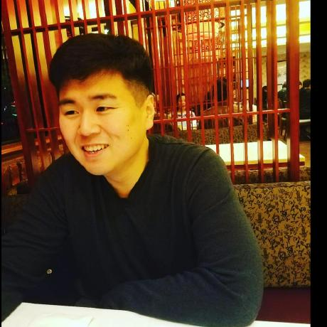
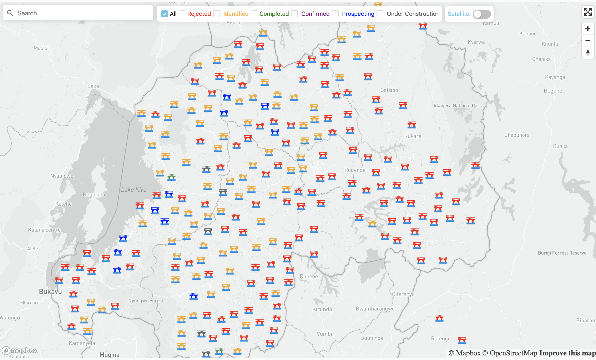
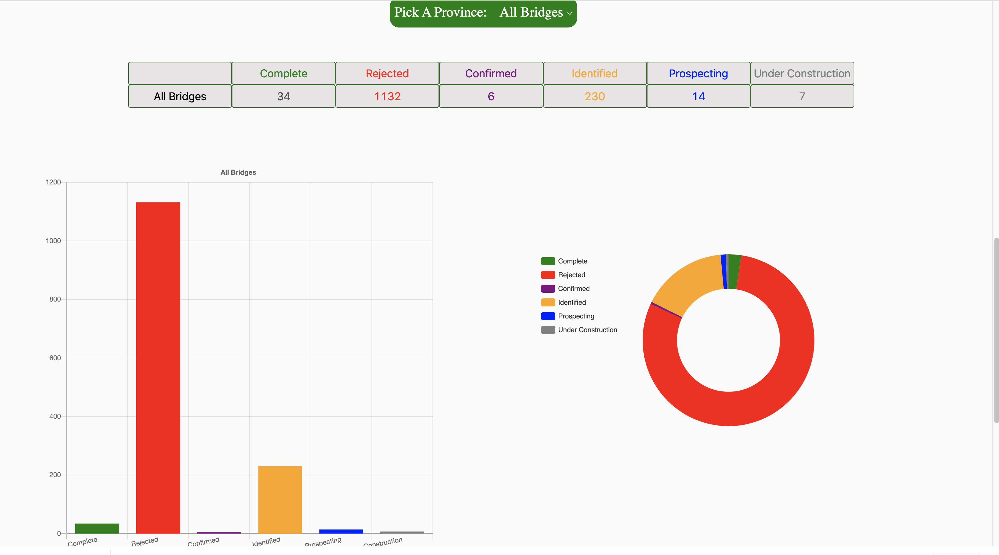

# Bridges To Prosperity

You can find the deployed project at https://a.bridgestoprosperity.dev/

## 8️⃣Contributors

|                                           [Devin Moore](https://github.com/devjaymoe)                                           |                                       [Joo Woon Kang](https://github.com/joowoonk)                                        |                                                     [Robert Misch](https://github.com/RobertMisch)                                                     |                                          [Jessica Cooper](https://github.com/JessicaGCooper)                                           |
| :-----------------------------------------------------------------------------------------------------------------------------: | :-----------------------------------------------------------------------------------------------------------------------: | :----------------------------------------------------------------------------------------------------------------------------------------------------: | :------------------------------------------------------------------------------------------------------------------------------------: |
|                     [](https://github.com/devjaymoe)                     |                 [](https://github.com/joowoonk)                  | [](https://github.com/RobertMisch) |                     [](https://github.com/JessicaGCooper)                     | [](https://github.com/) |
|                     [ ](https://github.com/devjaymoe)                      |                   [ ](https://github.com/joowoonk)                   |                                [ ](https://github.com/RobertMisch)                                |                      [ ](https://github.com/JessicaGCooper)                       |
| [  ](https://www.linkedin.com/in/devin-jay-moore) | [  ](https://www.linkedin.com/in/joowoonk/) |                     [  ](https://www.linkedin.com/)                      | [  ](https://www.linkedin.com/in/jessica-gertig-cooper/) |

|                                                             [Wei Peluso](https://github.com/weipeluso)                                                             |                                                           [Daniel Johnson](https://github.com/daniel-j-dev)                                                           |                                                              [Liam Cox](https://github.com/liamcox)                                                               |                                                           [Cameron Kirby](https://github.com/cameron-kirby)                                                            |
| :----------------------------------------------------------------------------------------------------------------------------------------------------------------: | :-------------------------------------------------------------------------------------------------------------------------------------------------------------------: | :---------------------------------------------------------------------------------------------------------------------------------------------------------------: | :--------------------------------------------------------------------------------------------------------------------------------------------------------------------: |
| [](https://github.com/weipeluso) | [](https://github.com/daniel-j-dev) | [](https://github.com//liamcox) | [](https://github.com/cameron-kirby) | [](https://github.com/) |
|                                       [ ](https://github.com/weipeluso)                                       |                                       [ ](https://github.com/daniel-j-dev)                                       |                                       [ ](https://github.com/liamcox)                                        |                                       [ ](https://github.com/cameron-kirby)                                       |
|                     [  ](https://www.linkedin.com/in/weipeluso/)                     |                 [  ](https://www.linkedin.com/in/daniel-software-dev/)                  |                   [  ](https://www.linkedin.com/in/liam-cox1010/)                   |                     [  ](https://www.linkedin.com/in/kameroncirby/)                      |

<br>

## Project Overview

1️⃣ [Trello Board](https://trello.com/b/xgSGOPbp/labs-27-bridges-to-prosperity-team-b)

1️⃣ [Product Canvas]()

[](https://a.bridgestoprosperity.dev/)

[](https://a.bridgestoprosperity.dev/)

[](https://a.bridgestoprosperity.dev/)

<h2>Description</h2>

Our website receives and displays data from our backend API. Displays data on mapbox interface, using React Map Gl, and also on ant design table. Users are unable to interact with the data on the mapbox interface and the table to view additional information and edit data points. Users can zoom in and the boundaries of all the communities will show, also users can switch to the satellite style We used react-chartjs-2 and echarts for data visualization.

## 5️⃣ Key Features

- Mapbox Interface (React Map Gl)
- Ant Design Table
- echarts for react
- react chartjs-2
- Yup Validations Formik Form

## 1️⃣ Tech Stack

### Front end built using:

- Context API
- Okta
- Ant Design
- Axios
- React-map-gl
- React-map-gl-geocoder
- React-router-dom
- Formik & Yup
- Node-Sass
- react-chartjs-2
- echarts-for-react

#### _Front end framework goes here_

- React

Why did you choose this framework?

- Our team had experience with the React Framework.

List the rest of the front end features and libraries in the same format as the framework above.

#### Front end deployed to `AWS`

https://a.bridgestoprosperity.dev/

#### [Back end] built using:

https://github.com/Lambda-School-Labs/Labs27-B-Bridges-BE

#### back end framework goes here

- nodejs
- express
- postgreSQL
- Docker

# APIs

## 2️⃣ Authentication API here

Okta API for Authentication:

The Okta Identity Cloud gives you one trusted platform to secure every identity in your organization and connect with all your customers.

## 3️⃣ Environment Variables

```md
REACT_APP_CLIENT_ID=0oalwt....
REACT_APP_OKTA_ISSUER_URI=https://auth.../default
REACT_APP_API_URI=http://localhost:8000
REACT_APP_MAPBOX_TOKEN='pk.eyJ1Ij......'
```

## 5️⃣ Content Licenses

🚫For all content - images, icons, etc, use this table to document permission of use. Remove the two placeholders and add you content to this table

| Image Filename    | Source / Creator | License                                          |
| ----------------- | ---------------- | ------------------------------------------------ |
| green bridge icon | Icons8           | [Icons8](https://icons8.com/license)             |
| rings.svg         | Sam Herbert      | [MIT](https://github.com/SamHerbert/SVG-Loaders) |

All the other images provided from Bridges to Prosperity

## 4️⃣ Testing

We used JEST to have basic testing for the front end.

## Other Scripts

```json
 "scripts": {
    "start": "craco --max_old_space_size=4096 start",
    "build": "craco --max_old_space_size=4096 build",
    "test": "craco test --env=jest-environment-jsdom-sixteen",
    "eject": "react-scripts eject",
    "prettier": "prettier --write \"**/*.+(js|jsx|json|css|md)\"",
    "coverage": "npm test -- --coverage --watchAll=false",
    "lint": "eslint 'src/**/*.{js,jsx}' --fix",
    "format": "prettier --write 'src/**/*.{js,jsx,css,scss}'",
    "storybook": "start-storybook",
    "deploy-storybook": "storybook-to-ghpages"
  },
```

### Feature Requests

We would love to hear from you about new features which would improve this app and further the aims of our project. Please provide as much detail and information as possible to show us why you think your new feature should be implemented.

### Pull Requests

If you have developed a patch, bug fix, or new feature that would improve this app, please submit a pull request. It is best to communicate your ideas with the developers first before investing a great deal of time into a pull request to ensure that it will mesh smoothly with the project.

Remember that this project is licensed under the MIT license, and by submitting a pull request, you agree that your work will be, too.

#### Pull Request Guidelines

- Ensure any install or build dependencies are removed before the end of the layer when doing a build.
- Update the README with details of changes to the interface, including new plist variables, exposed ports, useful file locations and container parameters.
- Ensure that your code conforms to our existing code conventions and test coverage.
- Include the relevant issue number, if applicable.
- You may merge the Pull Request in once you have the sign-off of two other developers, or if you do not have permission to do that, you may request the second reviewer to merge it for you.

## Documentation

See [Backend Documentation](https://github.com/Lambda-School-Labs/Labs25-Bridges_to_Prosperity-TeamB-be) for details on the backend of our project.

See [React Map GL](https://visgl.github.io/react-map-gl/) for details on the mapbox interface library.


[](https://github.com/prettier/prettier)
